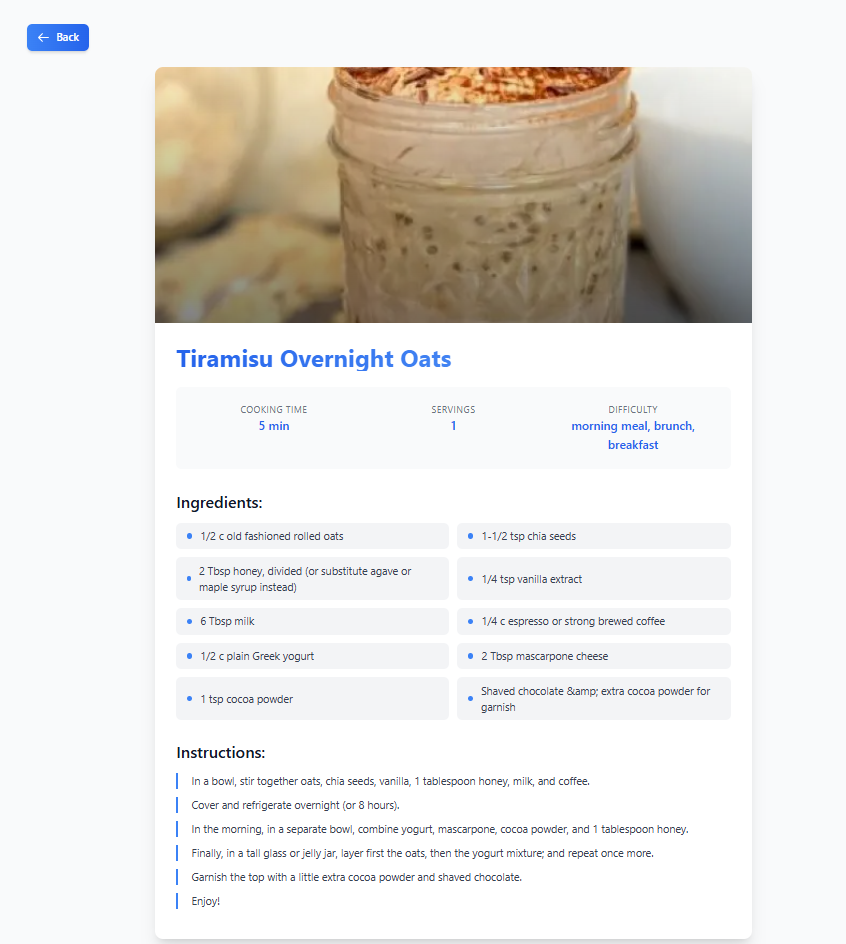
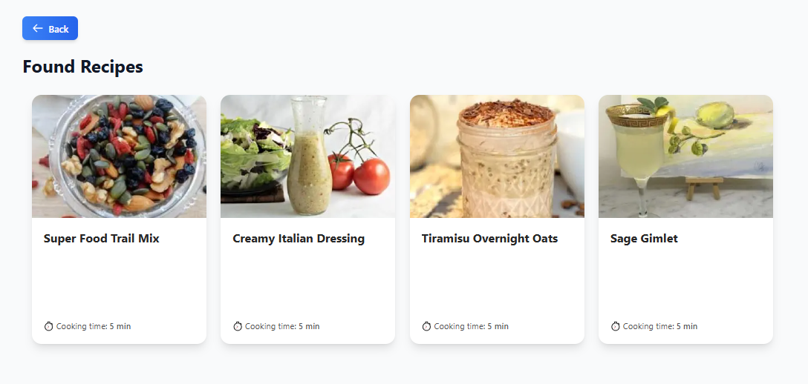
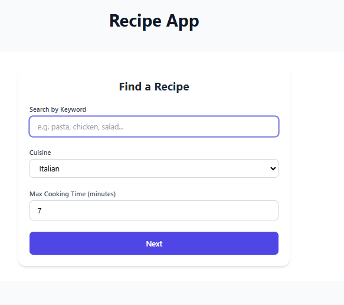

# Recipe Finder App


## Technologies

- Next.js
- React
- Tailwind CSS
- Spoonacular API
- Server-Side Rendering (SSR)


## Key Features

- Find recipes by entering a search term
- Filter results based on cuisine type
- Set a maximum cooking time for results
- View complete details of individual recipes
- Fully responsive layout across devices


## Installation

1. Clone the project repository:

```bash
git clone https://github.com/yourusername/recipe-finder-app.git
cd recipe-finder-app
```

2. Install dependencies:

```bash
npm install
```

3. Create a `.env.local` file in the root directory and add your Spoonacular API key:

```
NEXT_PUBLIC_SPOONACULAR_API_KEY=your_api_key_here
```

4. Start the development server:

```bash
npm run dev
```

5. Open [http://localhost:3000](http://localhost:3000) in your browser.

## Project Structure

```
recipe-finder-app/
├── pages/
│   ├── index.js              # Home page with search form
│   ├── recipes/
│   │   ├── index.js          # Recipe list page
│   │   └── [id].js           # Recipe details page
├── components/
│   ├── SearchForm.js         # Search form component
│   ├── RecipeList.js         # Recipe list component
│   ├── RecipeCard.js         # Recipe card component
│   └── RecipeDetails.js      # Recipe details component
├── .env.local                # Environment variables
├── .eslintrc.js             # ESLint configuration
├── .prettierrc              # Prettier configuration
└── README.md                # Project documentation
```

## Spoonacular API

This project uses the [Spoonacular API](https://spoonacular.com/food-api) to fetch recipe data. To use the API, you need
to:

1. Register at [Spoonacular](https://spoonacular.com/food-api/console#Dashboard)
2. Get an API key
3. Add the key to your `.env.local` file

## Screenshots

### Search Page



### Recipes Page



### Recipe Details Page


